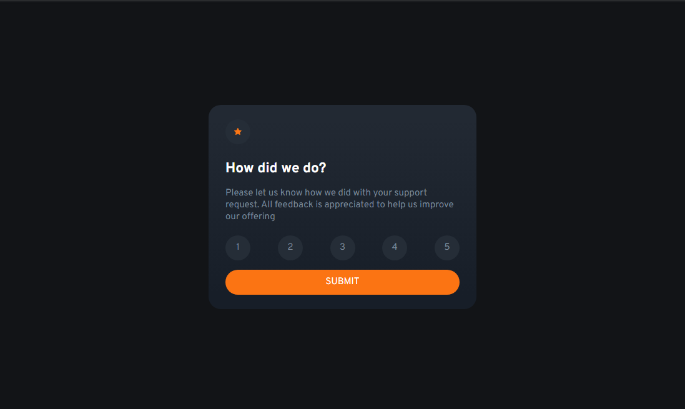
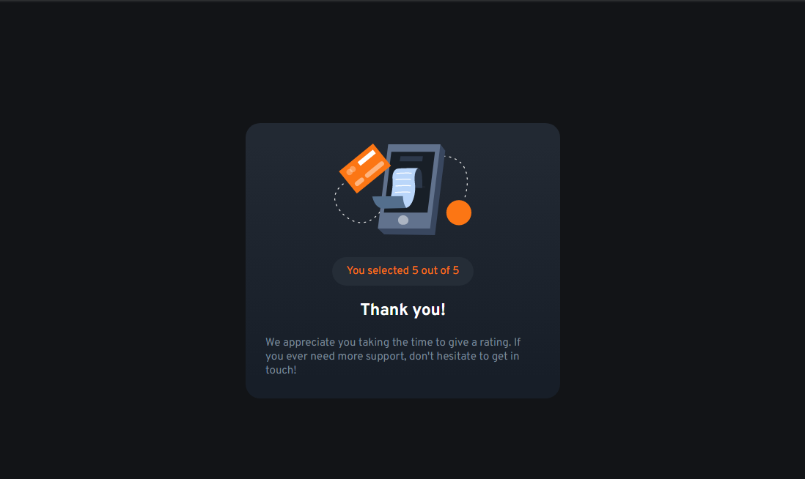

# Frontend Mentor - Interactive Rating Component

This is a solution to the [Interactive rating component challenge on Frontend Mentor](https://www.frontendmentor.io/challenges/interactive-rating-component-koxpeBUmI).

## Table of contents

- [Overview](#overview)
  - [The challenge](#the-challenge)
  - [Screenshot](#screenshot)
  - [Links](#links)
- [My process](#my-process)
  - [Built with](#built-with)
  - [What I learned](#what-i-learned)
  - [Continued development](#continued-development)
  - [Useful resources](#useful-resources)
- [Author](#author)

## Overview

### The challenge

Users should be able to:

- View the optimal layout for the app depending on their device's screen size
- See hover states for all interactive elements on the page
- Select and submit a number rating
- See the "Thank you" card state after submitting a rating

### Screenshot






### Links

- Solution URL: [Add solution URL here](https://your-solution-url.com)
- Live Site URL: [Add live site URL here](https://your-live-site-url.com)

## My process

### Built with

- Semantic HTML5 markup
- CSS custom properties
- Flexbox
- Mobile-first workflow
- [React](https://reactjs.org/) - JS library
- [Vite](https://vitejs.dev/) 


### What I learned

With this application I learned more about the use of states on React

I've also learned how to hide elemnts of the DOM by updating the _visible_ (boolean) variable with an onClick event


```jsx

{visible && 
        <>
          <Logo />
          <div>
            <h1>How did we do?</h1>
            <p>Please let us know how we did with your support request. All feedback is appreciated to help us improve our offering</p>
          </div>
          <Rating currentRating={currentRating} setCurrentRating={setCurrentRating}/>
          <button onClick={handleVisibility}>SUBMIT</button>
        </>
      }
      {!visible &&
        <ThankYou rating={currentRating}/>
      }
```

```js
const handleVisibility = () => {
    setVisible(prev => !prev)
  }
```


### Continued development


I'm not particularly comfortable with the way I handled the rating logic. Adding all of the buttons to an array and then incresing the index value + 1 to change the className works, but there's gotta be a more elegant solution.

```js

const Rating = ({currentRating, setCurrentRating}) => {
  
  const handleRating = (value) => {
    setCurrentRating(value)
  }
  
  const buttons = []
  
  for (let i = 0; i < 5; i++) {
    buttons.push(<Button index={i+1}/>)
  }
  
  return (
    <ul>
      {buttons.map((button, index) =>(
        <li key={index +1} onClick={() => handleRating(index + 1)} className={index + 1 == currentRating ? 'selected' : 'circleContainer'}> 
          {button}
        </li> 
        )
      )}
    </ul>
  )
}
```

### Useful resources

- [Dynamically changing CSS classes](https://www.andreasreiterer.at/dynamically-add-classes/) - Used this resource for updating the className of each list item
- [How to toggle boolean state of a React component?](https://stackoverflow.com/questions/40359800/how-to-toggle-boolean-state-of-a-react-component) - This helped me with manaing how to show the Thank You state.
In particular:
```js
const [check, setCheck] = useState(false);
// ...
setCheck(prevCheck => !prevCheck);
```


## Author

- Github - [Martineznacho4](https://github.com/martineznacho4/)
- Frontend Mentor - [@martineznacho4](https://www.frontendmentor.io/profile/martineznacho4)

